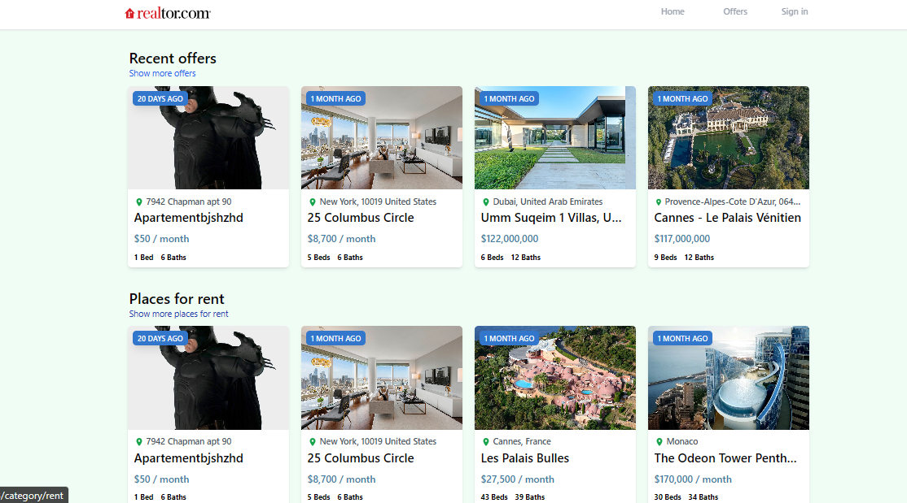

# Realtor Clone build with React JS and Tailwind CSS
# Preview :
 

 # Description
  This feature-packed app enables users to effortlessly sign up and sign in using their email or Google account. With a seamless interface, users can browse, create, update, and delete property listings, providing a complete CRUD experience.
 

# Installation
1. Install all dependencies with `npm install`
2. cd into your repositore folder and run `run start`

# Tools and frameworks used in this project:
1. React JS
2. Firebase Authentification
3. Firebase Firestore
4. Tailwind CSS
5. Axios 
6. Swiper

